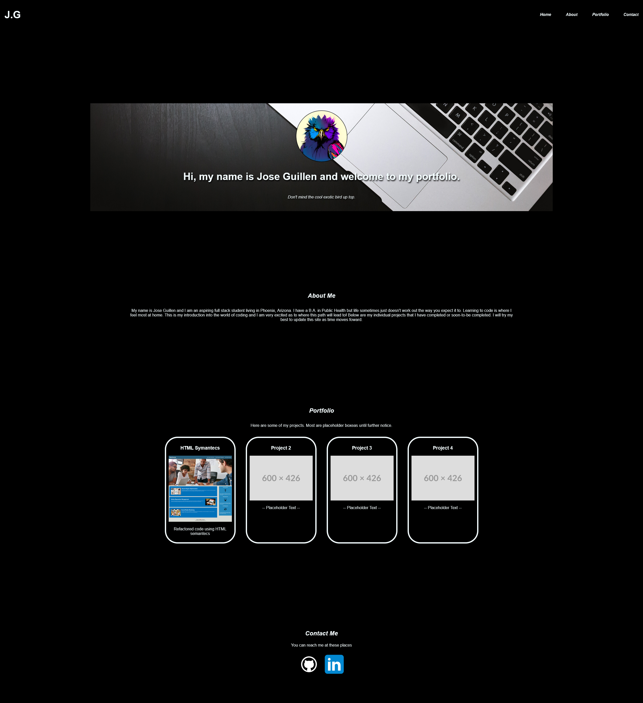
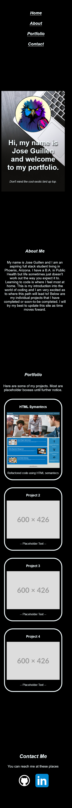

# Week 2 Challenge - Online Portfolio

## Description

I was tasked with creating my very own portfolio site while following some key areas. It is functionally a very basic website with an avatar of my online bird persona, a small about me section, my completed works so far, and some contact links. I figured simplicity would be the goal here for a first website. The site had to be dynamically responsive to different screen resolutions which I tried to the best of my ability. It still doesn't look quite the way I want it to look on some phone screens but I think it barely passes as an attempt. No javascript was used for this site as all the buttons and smooth scrolling was done via CSS. A lot of testing with various lines of CSS code is scattered throughout my CSS file commented out. I didn't want to delete any of it just to show all the things I did try. I also did receive help from a wonderful TA for @media queries. You know who you are!

## Screenshot on Desktop Example

## Screenshot on Mobile Example

## Usage

Open your web browser's inspect tool to see the HTML layout of the site. Play around with different screen resolutions to see how the site looks. Again, not perfect but somewhat okay.

## Deployment Link

Deploy - 

Github repo - 